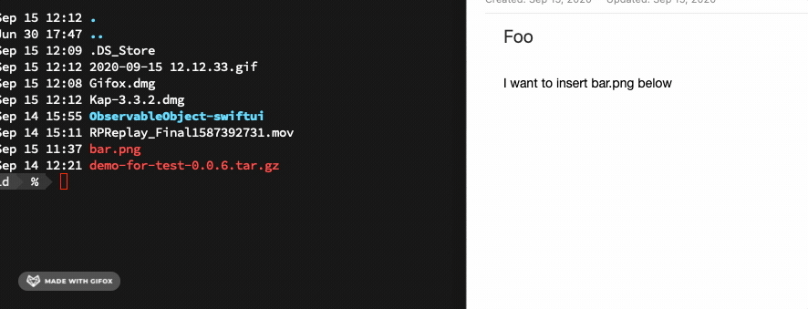

### 工具干什么用
用来快速在命令行中复制文件, 这样就可以可以在 Evernote, Mail 等上粘贴图片/PDF 等文件



### 为什么写这个工具

本人的很多工作严重依赖命令行工具,  比如有人在微信上你要一个文件在`/Users/foo/Downloads/bar.png`常见的工作流是

1. 快速进入一个目录:  `j Downloads`
2. 找到`bar.png`
3. 在没有 `pbadd` 工具的时候, 需要 `open .` 然后 `Command + c`   然后切换到 Evernote 上 `Command + v`

使用 `open` 的问题是如果文件很多的话, 还需要在 Finder 中搜索一下:-( 

有了 `pbadd` 之后的工作流

1. 快速进入一个目录:  `j Downloads`
2. `pbadd foo.png` 然后切换到 Evenote 上 `Command + v` 😊

[V2ex](https://v2ex.com/t/700647) 上发现有人有类似的问题, 但是帖子中的 Applescript 只能添加一个文件, 而且不能支持相对路径

我想要一个可以支持**批量文件**和不需要考虑(相对/绝对)路径的复制工具(Let computer do the thing)

所以就自己写个这个简单工具

### 安装

1. 下载 [pbadd](https://github.com/yujinqiu/pbadd/releases) 二进制文件到系统 PATH (比如 `/usr/local/bin`) 中
2. 设置可执行权限 `chmod 0755 /usr/local/bin/pbadd`


### 用法
```
pbadd file1 file2 ... fileN
```
然后就可以开心去 Evernote 等 `Command + v` 😊
会自动判断文件是否存在, 不存在文件会被自动过忽略

### 和pbcopy 有什么区别

`pbcopy` 是读取**文件内容**, 这样在粘贴的时候只是对应的内容

`pbadd` 是复制**文件本身**, 可以在粘贴文件本身, 而不是内容


### 致谢
[PathKit](https://github.com/kylef/PathKit)  BSD License.
